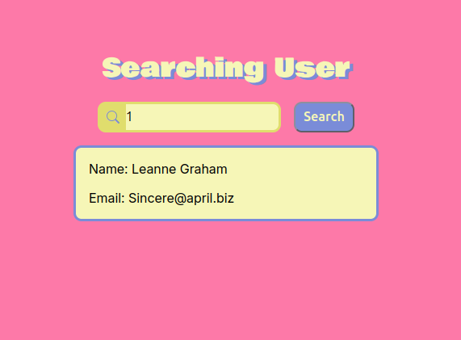

# Searching User



Proyecto realizado para practicar el consumo de APIs utilizando `fetch()` en JavaScript.

La aplicación permite introducir el ID de un usuario y obtener sus datos desde la API [JSONPlaceholder](https://jsonplaceholder.typicode.com/).

## Tecnologías

* HTML5
* CSS3
* JavaScript
* Fetch API
* JSONPlaceholder

## Funcionamiento

El usuario introduce un ID y pulsa el botón **Search**. La aplicación realiza una petición a:

```text
https://jsonplaceholder.typicode.com/users/{id}
```

Si la petición es correcta, se muestran el nombre y el email del usuario.

También se gestionan errores de conexión y diferentes códigos de estado HTTP como `400`, `401`, `403`, `404`, `429`, `500` y `503`.

## Conceptos practicados

* `fetch()`
* `async / await`
* `try / catch / finally`
* Promesas
* Respuestas HTTP
* Conversión de JSON
* Manipulación del DOM
* Validación de formularios
* Diseño responsive

## Estructura

```text
searching-user/
├── index.html
├── css/
│   └── style.css
└── js/
    └── main.js
```
## Diseño

La interfaz utiliza una combinación de colores basada principalmente en:

- Rosa #FD79A8
- Amarillo #E0DD6D
- Amarillo claro #F6F6B7
- Azul #7A8CD8

También se utilizan las fuentes:

- Bowlby One para el título.
- Inter para el contenido general.

## Ejecución

Clona el repositorio y abre `index.html` en el navegador. También puedes utilizar **Live Server** desde Visual Studio Code.
